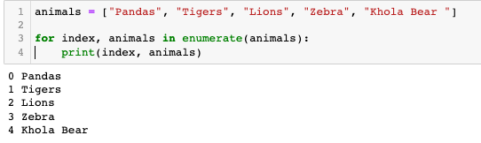
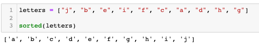
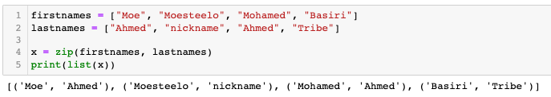
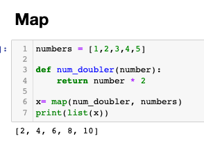

# Analytics_Built_In_PythonFunctions
**12 of the most used built in functions data Analytics and Data Scientists use**

## Overview 

### 1) Enumerate Function 
- **The `enumerate()` function allows you to write a for loop that comes with an index. This means we can automatically assign a count variable to each item in an iterable. When we use enumerate(), we get back the count of the current iteration, and then the value of the item at that iteration.Also adding `start` function can start the index from 1 instead of 0**

### 2) Sorted Function

- **The `Sorted` function takes an iterable pbject and returns a sorted list of all the items in siad iterable. Strings are sorted alphabetically while numbers are sorted numerically. We can also specify the sorted order by assigning the ***True***** **(descending) or** ***False*** **(ascending) to the reverse arguemnt**

### 3) Zip Function

- **The `zip()` function is used to assign items from different iterators together. It returns a zip object, containing tuples of the corresponding items in each iterable.It can also be used together with the built-in dict() function to create a dictionary object.Finally, we can use the zip() function to unpack a series of elements (tuples) in a list to independent tuples by using the * operator.**

### 4) Map Function

- **The `map()` function takes in another function and an iterable object such as a string or tuple and returns the results after applying the given function to each item in the iterable.** 

### 4) Filter Function

- **Like the map() function, the filter() function also takes in another function and an iterable such as a list or tuple and then returns the elements in the iterable for which the function returns True.**

